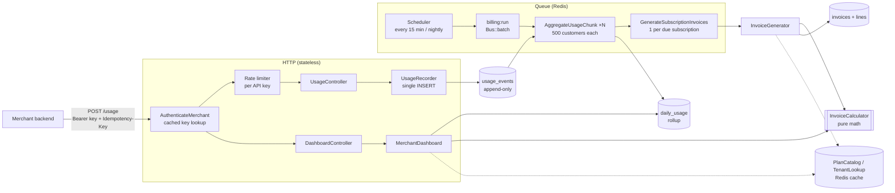
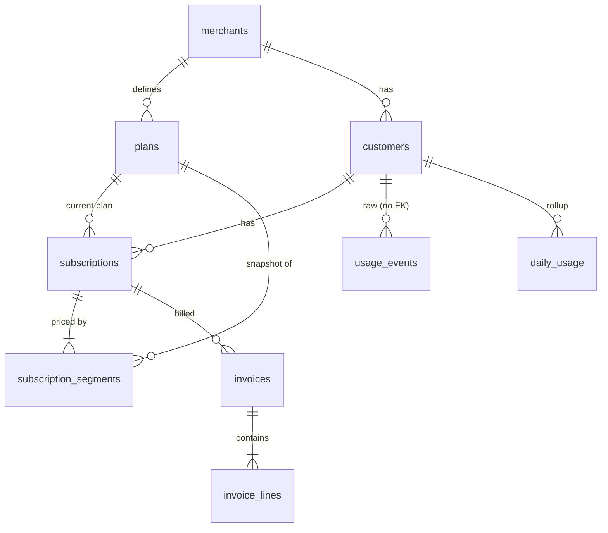
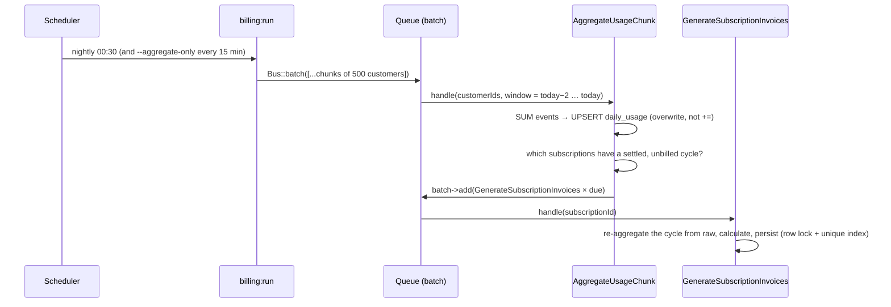

# Subscription Billing & Usage Metering

A multi-tenant Laravel 13 backend that meters customer usage against subscription plans and produces invoices, with proration, overage, and plan changes in the middle of a cycle. It also includes a merchant dashboard (JSON API plus a small web UI that uses the same API).

> **TL;DR for reviewers**
> - `POST /api/v1/usage` needs one `INSERT` on the hot path. It is **idempotent** through a unique index (a retry returns `200` and nothing is counted twice; reusing a key with a different payload returns `409`), and it is **rate-limited per API key**.
> - A **queued, chunked** billing run rebuilds `daily_usage` from raw events with *overwrite* upserts, so any run can be repeated safely. It then issues invoices for **settled** cycles.
> - A mid-cycle upgrade or downgrade splits the subscription into **segments**. Each segment snapshots the plan's pricing and is **billed separately**, with base price and allowance prorated by days.
> - All money math is in one pure class, [`InvoiceCalculator`](app/Billing/InvoiceCalculator.php), which has 21 unit tests. The dashboard's projection runs through **the same** calculator.
> - Measured at **50 lakh rows**: one invoice takes 3.8 ms, a nightly 500-customer chunk takes 14.8 ms, and the aggregation query is an index-only scan ([numbers](#scaling-usage_events-to-50l-rows)).
> - **63 tests / 243 assertions**. See also the [code review of the draft PR](docs/code-review.md), the [rollout note](#rollout--monitoring) and [Handing this off](#handing-this-off).

---

## Contents

1. [Quick start](#quick-start)
2. [Architecture](#architecture)
3. [Data model](#data-model)
4. [Scaling usage_events to 50L+ rows](#scaling-usage_events-to-50l-rows)
5. [Recording usage (idempotency & throughput)](#recording-usage)
6. [Aggregation & invoicing pipeline](#aggregation--invoicing-pipeline)
7. [Billing rules](#billing-rules)
8. [Caching & invalidation](#caching--invalidation)
9. [Dashboard](#dashboard)
10. [API reference](#api-reference)
11. [Tests](#tests)
12. [Assumptions & decisions](#assumptions--decisions)
13. [Code review exercise](#code-review-exercise)
14. [Rollout & monitoring](#rollout--monitoring)
15. [Handing this off](#handing-this-off)

---

## Quick start

**Requirements:** PHP 8.3+ (with `intl`, `pdo_sqlite`), Composer, and Redis (optional, see below).

```bash
git clone <repo> subscription-billing && cd subscription-billing
composer install
cp .env.example .env && php artisan key:generate
touch database/database.sqlite
php artisan migrate --seed          # prints demo API keys and a dashboard link
php artisan serve                   # http://localhost:8000/dashboard
```

The seeder builds about four months of realistic data for two tenants: mid-cycle starts, an upgrade, a downgrade, customers in overage, two declining customers, and invoices for every settled cycle. It prints ready-to-use API keys:

| Merchant | ID | API key (local demo only) |
|---|---|---|
| Acme Corp | 1 | `mk_demo_acme_corp_local_only_do_not_use_in_prod` |
| Globex Ltd | 2 | `mk_demo_globex_local_only_do_not_use_in_prod` |

Open **http://localhost:8000/dashboard#merchant=1&key=mk_demo_acme_corp_local_only_do_not_use_in_prod**. The key goes in the URL fragment, so it is never sent to the server or written to access logs.

**Redis.** `.env.example` uses Redis for cache, queue and rate limiting, through `predis`, so no PHP extension is needed. To run without Redis, set `CACHE_STORE=database` and `QUEUE_CONNECTION=database`. Everything works the same way. Tests always use the array cache and the sync queue.

**Running the billing pipeline:**

```bash
php artisan queue:work                        # worker for the chunked jobs
php artisan billing:run                       # aggregate + invoice settled cycles (queued batch)
php artisan billing:run --aggregate-only      # just refresh daily_usage
php artisan billing:run --date=2026-10-03 --sync   # as-of a date, in-process (demos/backfills)
php artisan schedule:work                     # runs both on schedule (see routes/console.php)
```

**Other commands:** `php artisan merchant:create "Name"` creates a tenant and prints its key once. `php artisan test` runs the suite. `php artisan usage:load-test` runs the benchmark below, so point it at a throwaway database.

**MySQL** also works. Set `DB_CONNECTION=mysql` and run `migrate --seed`. The schema and queries avoid driver-specific SQL, and dates are stored as `Y-m-d` on every driver (see [`DateOnly`](app/Casts/DateOnly.php)).

---

## Architecture



| Layer | Where | Responsibility |
|---|---|---|
| Pure domain | `app/Billing/` | `Period`, `SegmentTerms`, **`InvoiceCalculator`**. No DB and no clock, so it is trivially testable. |
| Services | `app/Services/` | `UsageRecorder` (idempotent ingest), `UsageAggregator` (rollup), `InvoiceGenerator` (persist invoices), `SubscriptionService` (subscribe, change plan, cancel as segments), `MerchantDashboard`, `PlanCatalog` / `TenantLookup` (caches) |
| Jobs | `app/Jobs/` | `AggregateUsageChunk` (chunk of customers), `GenerateSubscriptionInvoices` (one subscription) |
| HTTP | `app/Http/` | Thin controllers, FormRequests for validation, API Resources for output, and API-key auth middleware |
| Tenancy | [`BelongsToMerchant`](app/Models/Concerns/BelongsToMerchant.php) | Route model binding resolves **only within the calling merchant**. Another tenant's ID returns `404`, the same as a missing record. |

---

## Data model



| Table | Key columns | Indexes / constraints |
|---|---|---|
| `merchants` | `api_key_hash` (SHA-256), `currency` | unique `api_key_hash` |
| `plans` | `billing_interval`, `base_price` (paise), `included_units`, `overage_rate` DECIMAL(18,6) paise/unit | unique `(merchant_id, code)` |
| `customers` | `external_id` (merchant's own ID) | unique `(merchant_id, external_id)` |
| `subscriptions` | `status`, `started_on`, `ends_on`, **`billed_through`** | `(customer_id, status)`, `(merchant_id, status)` |
| `subscription_segments` | `starts_on`, `ends_on` (inclusive), **pricing snapshot** | unique `(subscription_id, starts_on)` |
| `usage_events` | `merchant_id`, `customer_id`, `idempotency_key`, `units`, `usage_date` | **unique `(merchant_id, idempotency_key)`**, **`(customer_id, usage_date, units)` covering** |
| `daily_usage` | one row per customer per day: `units`, `event_count` | unique `(customer_id, usage_date)`, `(merchant_id, usage_date, customer_id, units)` covering |
| `invoices` | `period_start/end`, `total` | **unique `(subscription_id, period_start)`**, `(merchant_id, period_start)` |
| `invoice_lines` | `type` base/overage, `quantity`, `unit_price`, `amount`, `meta` (usage and allowance used) | FK `invoice_id` |

**Why segments?** A subscription is a sequence of non-overlapping `subscription_segments`, and each one copies the plan's price, allowance and rate when it starts. That one structure covers every case: a mid-cycle start (the first segment starts mid-cycle), an upgrade or downgrade (close one segment, open another), a cancellation (close the last one), and plan price edits (existing segments keep their snapshot, so history is never rewritten).

**Money** is stored as integers in minor units (paise). Per-unit overage rates can be fractional paise (for example ₹0.005 per call), so they are stored as `DECIMAL(18,6)`. All arithmetic uses `brick/math` `BigDecimal`, never floats.

---

## Scaling usage_events to 50L+ rows

**Design choices for a table that takes high write volume:**

- **Narrow and append-only.** Six columns, rows never updated or deleted, and no foreign keys (each FK is an extra lookup on every insert). Ownership is validated before the write.
- **Exactly two secondary indexes.** Each one has a job:
  1. `UNIQUE (merchant_id, idempotency_key)` enforces idempotency.
  2. `(customer_id, usage_date, units)` is a **covering index** for the rollup: `SUM(units) … GROUP BY customer_id, usage_date` never reads the table rows.
- **Nothing downstream reads the raw table** except the aggregator. The dashboard and billing read `daily_usage`, which has *customers × days* rows: 2,000 customers × 365 days is 7.3 lakh rows per year, whatever the event volume.

**Measured.** This comes from `php artisan usage:load-test --rows=5000000` on SQLite (WAL) on an Apple-silicon laptop with 2,000 customers and 90 days of data:

| Operation at 5,000,000 rows | Time |
|---|---|
| Single-row idempotent insert (the API write path, averaged over 200) | 0.1 ms |
| Nightly chunk: re-aggregate 500 customers × 3-day window | 14.8 ms |
| Full backfill: 2,000 customers × 90 days, chunked | 1.24 s |
| Generate one invoice (including re-aggregating its cycle from raw) | 3.8 ms |
| Dashboard compute, uncached, 2,000 active subscriptions | 517 ms |

```
EXPLAIN QUERY PLAN (aggregation):
SEARCH usage_events USING COVERING INDEX usage_events_customer_id_usage_date_units_index
       (customer_id=? AND usage_date>? AND usage_date<?)
```

These are single-node SQLite numbers, so treat them as relative, not as a production SLA. What they show is that no query touches more rows than it needs.

**What I'd do next as volume grows (not implemented):**

| When | Change | Why / trade-off |
|---|---|---|
| ~crores of rows | **MySQL RANGE partitioning on `usage_date`**, monthly | Pruning keeps the rollup to one or two partitions, and retention becomes `DROP PARTITION` instead of a huge `DELETE`. **Catch:** MySQL requires the partition key in every unique key, so the PK becomes `(id, usage_date)` and idempotency becomes `UNIQUE (merchant_id, idempotency_key, usage_date)`. That is safe because a retry always resends the same date, but a key reused *on a different date* would no longer be detected as a conflict. The alternative is a small separate `idempotency_keys` table with a TTL. |
| Retention | Archive invoiced months to cold storage (S3/Parquet) after N months | Raw events are only needed for audits and disputes once `daily_usage` and the invoice exist. |
| Dashboard at 1L+ subscriptions | A denormalized **`cycle_usage` running total** per subscription per cycle, updated by the aggregator | Today the projection loops over subscriptions in PHP (chunked, and cached for 60 s). |
| Very high ingest | Buffer writes (Redis stream or Kafka) and bulk-insert them, or accept a `POST /usage/batch` | This trades the synchronous "recorded" guarantee for throughput. The idempotency key still de-duplicates downstream. |
| Analytics | Move raw events to a columnar store (ClickHouse) | OLTP stays small. |

`daily_usage` is itself the planned denormalization. It also keeps `merchant_id` (derivable from the customer) so dashboard queries never join. `subscriptions.merchant_id` is denormalized for the same reason.

---

## Recording usage

```http
POST /api/v1/usage
Authorization: Bearer mk_…
Idempotency-Key: 6f1c2a4e-…            # required, ≤64 chars, [A-Za-z0-9_-:.]
Content-Type: application/json

{ "customer_id": 1, "units": 250, "usage_date": "2026-09-28" }
```

| Outcome | Status | Notes |
|---|---|---|
| New event | `201` | `Idempotent-Replayed: false` |
| Same key, same payload (retry) | `200` | `Idempotent-Replayed: true`, returns the **original** event, and nothing is counted |
| Same key, different payload | `409` | `{"error":"idempotency_key_reused"}`. This is a client bug, so we surface it instead of hiding it. |
| Unknown / other tenant's customer | `422` | Same message for both cases, so other tenants' IDs are never confirmed |
| Invalid units, future date, or older than 2 days | `422` | |
| Bad / missing key | `401` | |
| Over the rate limit | `429` | Includes `Retry-After` |

**How idempotency works** ([`UsageRecorder`](app/Services/UsageRecorder.php)). The recorder *attempts the insert first* and relies on the unique index. It does not "check, then insert", which races when two retries arrive together. Only when the insert hits a unique violation does it read the original event back to decide between `200` and `409`. The happy path is one `INSERT`. With a warm cache, the API-key lookup and the customer-ownership check cost **zero reads**.

**Rate limiting.** 120 requests per minute per **API key** by default (`USAGE_RATE_LIMIT_PER_MINUTE`). It is keyed on the merchant, not the IP, so one tenant can't starve another and nobody can get around the limit by spreading requests across IPs. Other endpoints have a separate limit of 60/min.

---

## Aggregation & invoicing pipeline



- **Chunked.** One job per 500 customers (`BILLING_CHUNK_SIZE`), dispatched as a `Bus::batch` with `allowFailures()`. One bad chunk doesn't block the others. The batch's `finally` callback records `last_aggregation_run`, which the dashboard shows.
- **Idempotent by design.** Aggregation **overwrites** each customer-day with the SUM recomputed from source, so re-runs, overlapping windows, crashed-and-retried jobs, and late events all converge on the correct total, with no watermark to keep consistent. Invoices are protected three times over: a `WithoutOverlapping` job middleware, a `SELECT … FOR UPDATE` on the subscription, and a `UNIQUE (subscription_id, period_start)` constraint as the last guard.
- **Settlement window.** Usage may be backdated at most `USAGE_MAX_BACKDATE_DAYS` (2). A cycle is invoiced only once `today > cycle_end + 2`, when no more usage can legally land in it. Because of that, **an issued invoice never needs amending for late usage.** The trade-off is that invoices go out about three days after the cycle ends. I think that's the right trade for billing. A backdated event arriving inside the window is still picked up, and there's a test for it.
- **Catch-up.** Each subscription tracks `billed_through`, so if runs are missed, the next run issues every overdue cycle in order.
- **Self-healing.** Invoice generation re-aggregates the cycle **from raw events** for that one customer before pricing it (an index-range scan). A missed nightly run can never under-bill.

---

## Billing rules

Cycles are **calendar-aligned**: monthly means the 1st to the last day of the month, and quarterly and yearly work the same way. Everything is computed in **whole days**, because usage is daily.

For each segment that overlaps the cycle, where `d` is the covered days and `D` is the days in the cycle:

```
base      = round_half_up(base_price     × d / D)            (paise)
allowance = round_half_up(included_units × d / D)            (units)
overage   = max(0, usage_in_segment − allowance) × overage_rate, round_half_up (paise)
invoice   = Σ base + Σ overage         (rounded per line, then summed)
```

**Worked example:** a subscription starts on 11 Sep on *Growth* (₹3,000, 3,000 units, ₹0.50 per extra unit) and upgrades on 21 Sep to *Scale* (₹9,000, 10,000 units, ₹0.20 per extra unit). This is the [`InvoiceGenerationTest`](tests/Feature/InvoiceGenerationTest.php) scenario.

| Line | Days | Usage | Allowance | Amount |
|---|---|---|---|---|
| Growth plan (prorated 10/30) | 11–20 Sep | | | ₹1,000.00 |
| Growth overage | | 1,500 | 1,000 | 500 × ₹0.50 = ₹250.00 |
| Scale plan (prorated 10/30) | 21–30 Sep | | | ₹3,000.00 |
| Scale overage | | 7,000 | 3,333 | 3,667 × ₹0.20 = ₹733.40 |
| **Total** | | | | **₹4,983.40** |

Usage on 5 Sep (before the start) is ignored. Usage **before** the upgrade is billed at Growth's rate, and usage **after** it at Scale's rate, as the brief requires.

**Why each segment is billed separately and not pooled:** if all usage in the cycle were pooled against a combined allowance, usage before the upgrade could be absorbed by the *new* plan's larger allowance. That effectively reprices it at the new plan's terms, which the brief rules out. There is a test that pins this down (`pre_change_usage_is_not_repriced_at_the_new_plans_rate`).

**Plan changes:**

- A change takes effect from the start of its effective day (default today). The old segment ends the day before.
- A change on the same day the current segment started replaces that segment instead of leaving a zero-day stub.
- A change may be backdated within the current unbilled cycle, never into an invoiced one (`422 period_already_invoiced`), and never before the current segment started.
- **Same billing interval only.** Switching monthly to yearly changes the cycle itself, and that needs a policy decision (credit the unused part? restart the cycle?). I'd rather reject it clearly than guess (`422 interval_mismatch`).
- Plan changes and cancellations with a **future** date are not supported yet (`422 future_change_unsupported`). See [Handing this off](#handing-this-off).

---

## Caching & invalidation

| What | Key | Used on | Invalidated by | TTL (safety net) |
|---|---|---|---|---|
| Plan by ID | `plans:{id}` | subscribe / change-plan, `GET /plans/{id}` | `PlanObserver` on save/delete, **after commit** | 10 min |
| Merchant's plan list | `merchants:{id}:plans` | `GET /plans`, dashboard | same | 10 min |
| API key → merchant | `merchants:api-key:{sha256}` | **every request** | `MerchantObserver` on update/delete. On key rotation both the old and the new hash are forgotten, so the old key stops working immediately. | 10 min |
| Customer → owner | `customers:{id}:merchant` | **every `POST /usage`** | `CustomerObserver` on delete (a customer never changes merchant) | 10 min |
| Dashboard | `dashboard:{merchant}:{date}` | dashboard | TTL only: it's an analytics view | 60 s |

**Principles:**

1. **Invalidate on write and use TTL only as a safety net.** Correctness comes from explicit invalidation; the TTL only bounds how long a missed invalidation can do damage.
2. **Invalidate after the transaction commits** (the observers implement `ShouldHandleEventsAfterCommit`). If we forgot the key inside the transaction, a concurrent reader could re-cache the *old* committed row before our update became visible. A test covers this.
3. **Only cache positive lookups.** A "not found" is never cached, so a customer created a second ago is usable at once. Rate limiting bounds the cost of repeated misses.
4. **Cache plain arrays, not serialized models.** Laravel 13 disallows unserializing classes from the cache by default, which blocks gadget-chain attacks if `APP_KEY` leaks. The code keeps that protection.
5. **Pricing snapshots make plan-cache staleness harmless for invoices.** Invoices read the segment snapshot, never the cached plan. A stale plan cache can at worst affect a subscribe or plan change made in the same instant as a price edit.

All keys live in [`CacheKeys`](app/Support/CacheKeys.php), so the strategy can be audited in one file.

---

## Dashboard

`GET /api/v1/merchants/{id}/dashboard` (the key must belong to `{id}`, otherwise `403`). The web page at `/dashboard` is a static page that calls this API.

| Field | Definition |
|---|---|
| `top_customers` | Top 5 by units in the **calendar month to date**, with `% of allowance` for the current cycle |
| `projected_overage_revenue` | For each active subscription: completed segments use actual usage, and the running segment's usage is **extrapolated linearly** to the end of the cycle. The result is priced with the **same `InvoiceCalculator`** that issues real invoices. |
| `churn_risk` | Active customers whose usage fell **by more than 50%** month over month. It compares **complete days only**: 1st to yesterday of this month against the same number of days at the start of last month (on the 1st, it compares full months). Customers with fewer than 100 units in the earlier window are ignored as noise (`CHURN_MIN_BASELINE_UNITS`). |
| `current_cycle` | Sum of usage so far and allowance across active subscriptions (each in its own cycle) |
| `daily_trend` | Last 30 days, with missing days filled with zeros |
| `system` | Cache and queue setup, last aggregation run, **last usage recorded at**, failed jobs |

Freshness: `daily_usage` is refreshed every 15 minutes and the response is cached for 60 seconds, so the dashboard is at most about 16 minutes behind. That is fine for analytics. Billing never relies on it.

---

## API reference

All routes are under `/api/v1` and need `Authorization: Bearer <merchant key>`. Errors are JSON with a stable `error` code.

| Method | Path | Notes |
|---|---|---|
| `POST` | `/usage` | Record usage (see above) |
| `GET` | `/merchants/{id}/dashboard` | Dashboard |
| `GET` `POST` | `/plans` | List (cached) / create |
| `GET` `PATCH` | `/plans/{plan}` | Update name, price, allowance, rate or active flag. Interval and code are immutable. |
| `GET` `POST` | `/customers` | List (cursor-paginated) / create |
| `GET` | `/customers/{customer}` | Includes the active subscription and its segments |
| `POST` | `/customers/{customer}/subscriptions` | `{plan_id, effective_date?}` → `201` or `409 already_subscribed` |
| `GET` | `/subscriptions/{subscription}` | With segments |
| `POST` | `/subscriptions/{subscription}/change-plan` | `{plan_id, effective_date?}` for an upgrade or downgrade |
| `POST` | `/subscriptions/{subscription}/cancel` | `{effective_date?}` (last billable day) |
| `GET` | `/invoices?customer_id=` | Cursor-paginated |
| `GET` | `/invoices/{invoice}` | With lines (quantity, unit price, and usage/allowance in `meta`) |

```bash
KEY=mk_demo_acme_corp_local_only_do_not_use_in_prod
curl -i localhost:8000/api/v1/usage -H "Authorization: Bearer $KEY" -H "Accept: application/json" \
     -H "Idempotency-Key: evt-001" -H "Content-Type: application/json" \
     -d "{\"customer_id\":1,\"units\":250,\"usage_date\":\"$(date -u +%F)\"}"
# run it again → 200 + Idempotent-Replayed: true; change units → 409

curl -s localhost:8000/api/v1/subscriptions/2/change-plan -H "Authorization: Bearer $KEY" \
     -H "Accept: application/json" -H "Content-Type: application/json" -d '{"plan_id": 2}'
```

---

## Tests

```bash
php artisan test      # 63 tests, 243 assertions, ~0.5 s
```

| Suite | Covers |
|---|---|
| `Unit/Billing/InvoiceCalculatorTest` (21) | Usage exactly at the allowance, one unit over, zero usage; proration for a mid-cycle start, a last-day start, 31-day months, leap-year February; half-up rounding of fractional-paise rates; cancellation; **upgrade, downgrade, multiple changes per cycle**; pre-change usage not repriced; overlapping segments rejected; projection (running and closed segments; projection at cycle end equals the invoice) |
| `Unit/Billing/BillingCycleTest` (5) | Monthly, quarterly and yearly boundaries; leap years; period overlap |
| `Feature/RecordUsageTest` (9) | 201 then replayed 200, 409 on key reuse, keys scoped per merchant, tenant isolation, validation matrix, backdate edge, 401, **429 per key** |
| `Feature/UsageAggregationTest` (5) | Rollup correctness, **re-run idempotency, late events converge**, scoping, chunked batch dispatch |
| `Feature/InvoiceGenerationTest` (6) | End to end with a mid-cycle start and an upgrade; **not invoiced before settlement**; late usage included; **generate twice gives one invoice**; catch-up of missed cycles; final prorated invoice after cancellation |
| `Feature/SubscriptionApiTest` (7) | Subscribe snapshot, 409 duplicate, segment split, same-day replace, price edits don't rewrite history, rule matrix, no backdating into invoiced cycles, **cross-tenant 404/403** |
| `Feature/PlanCacheTest` (5) | Warm cache runs **zero queries**, invalidation on update, **invalidation waits for commit**, catalog refresh, **key rotation revokes the old key** |
| `Feature/DashboardTest` (5) | Top 5, projected overage (including across an upgrade), churn rules (baseline, cancelled customers, −100%), zero-filled trend, tenant isolation |

Writing the tests surfaced three real bugs, which I fixed:

- Laravel's `date` cast stores `Y-m-d 00:00:00`, so SQLite range filters silently dropped the last day of every period. The fix was the [`DateOnly`](app/Casts/DateOnly.php) cast.
- The rate limiter ran *before* authentication, so every merchant shared one IP-keyed bucket. The auth middleware now implements `AuthenticatesRequests`, which Laravel always runs first.
- A new plan didn't report its `is_active` default.

---

## Assumptions & decisions

Wherever the brief was ambiguous, I made a call and wrote it down here:

1. **Tenancy and auth:** one API key per merchant, sent as a Bearer token and stored as a SHA-256 hash. Customers are addressed by our `id`; `external_id` stores the merchant's own reference. There are no end-user or admin logins.
2. **Cycles are calendar-aligned** (anniversary billing would also work, but calendar months make "this month", proration and dashboards unambiguous). All dates are UTC.
3. **One active subscription per customer.** It's enforced under a row lock.
4. **"Usage per customer per day":** events carry a client-supplied `usage_date`, many events per day are allowed, and they are rolled up per day.
5. **Late data:** usage may be backdated at most 2 days, and never future-dated. The same value defines the settlement window before invoicing.
6. **Proration is by days**, applies to both the base price *and* the included allowance, and rounds half-up per line.
7. **Overage is per segment** (see [Billing rules](#billing-rules)). A mid-cycle change is effective from the start of its day.
8. **Price edits apply to new subscriptions and plan changes**, not retroactively. Existing segments keep their snapshot; moving existing customers to a new price is an explicit plan change.
9. **Usage for a day with no active segment is stored but not billed.** It isn't rejected at ingest, so the hot path doesn't need a subscription lookup and nothing is lost if a subscription is fixed later.
10. **"50L+"** is read as 5 million+ rows (lakh), and that is what the load test uses.
11. **Currency:** one currency per merchant (INR by default). No tax, discounts, credits, payments or dunning.
12. **"This month"** for the top 5 means the calendar month to date. The overage projection uses each subscription's own cycle.

---

## Code review exercise

The draft `store()` from the brief is reviewed in **[docs/code-review.md](docs/code-review.md)**. The review is written the way I'd post it on the PR: blocking issues first, why each one matters, a suggested direction, and how I'd follow up with the engineer. In short: it can `500` on an unknown customer, it lets any caller write usage for any tenant's customer, retries double-bill, input isn't validated, and there's no rate limit and no tests. The version that shipped is [`UsageController`](app/Http/Controllers/Api/V1/UsageController.php) + [`RecordUsageRequest`](app/Http/Requests/RecordUsageRequest.php) + [`UsageRecorder`](app/Services/UsageRecorder.php).

---

## Rollout & monitoring

I'd roll this out in **shadow mode**. First, ship ingestion and have a few pilot merchants dual-write to both the legacy path and `POST /usage`. For one full cycle, generate invoices as drafts and reconcile them line by line against the legacy bill. Then turn on real invoicing merchant by merchant behind a feature flag, with the old path kept as a fallback until two cycles reconcile cleanly. Because every write is idempotent and aggregation can be re-run, we can replay or backfill at any point without double-counting.

The one thing an on-call engineer should see first if recording fails **silently** is **ingested usage events per minute, per merchant, compared with the same time last week**. A silent failure doesn't show up as 5xx errors; it shows up as a *drop in volume*, such as a client sending to the wrong key, events being rejected with `422`, or a merchant integration dying. The dashboard's **"Last usage recorded"** timestamp (`usage:last-recorded-at:{merchant}`) is the minimal version of this signal. In production I'd export it as a metric and alert on a drop, not just on error rates.

---

## Handing this off

If a mid-level engineer picked this up tomorrow, these are the three things I'd flag:

1. **All money math goes through `InvoiceCalculator`, nowhere else.** It is pure and heavily tested, and the dashboard reuses it on purpose. If a billing rule changes, change it there and add the edge-case test first. Don't compute amounts in controllers, jobs or SQL.
2. **Dates are calendar dates, not timestamps.** Use the `DateOnly` cast and compare `Y-m-d` strings or `CarbonImmutable` days. The default Laravel `date` cast looks fine on MySQL and silently breaks ranges on SQLite; this bit me, and the tests caught it.
3. **`USAGE_MAX_BACKDATE_DAYS` couples two things.** It controls how late usage can arrive *and* how long we wait before invoicing. Raising it delays every invoice; lowering it rejects more late data. Any change is a product decision, not just a config tweak.

**Corners I knowingly cut to fit the time-box:**

- No scheduled (future-dated) plan changes or "cancel at period end". Changes are only allowed within the same billing interval.
- No tax, credits, refunds, payment collection, or per-merchant invoice numbering. `INV-000123` uses the global ID.
- Partitioning, archival and a batch ingest endpoint are designed and documented above, but not built.
- The dashboard projection loops over subscriptions in PHP (chunked and cached). That is fine for tens of thousands of subscriptions; beyond that it needs the `cycle_usage` rollup.
- The load test ran on SQLite, not MySQL. The web UI loads Tailwind and Chart.js from CDNs instead of a Vite build, and has no browser tests.
- API keys have no scopes, no multiple keys per merchant, and no rotation endpoint (rotation exists in the model and is tested).

---

### AI assistance

I built this with Claude Code as a pair. All design decisions, trade-offs and numbers above were reviewed and verified by running the code and the test suite.
